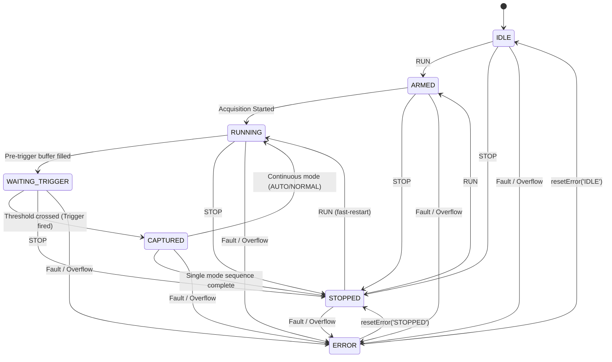

# Control Plane Architecture

## 1. Separation of Control Plane and Data Plane

В соответствии с правилами `GEMINI.md`, архитектура строго разделена на два независимых контура:

```mermaid
graph TD
    subgraph "Control Plane (Event-Driven / Low Frequency)"
        UI[UI / 3D Controls] -->|Commands| SVC[OscilloscopeService]
        SVC -->|Validate & Execute| OSC[Oscilloscope Aggregate]
        OSC -->|Emit Events| EB[EventBus]
        EB -->|State Notifications| UI
    end

    subgraph "Data Plane (High Frequency Stream: 1–5 MSPS)"
        GEN[SignalSource / Circuit Sim] -->|Raw Samples| ACQ[Acquisition Engine]
        ACQ -->|Batched Chunks| RING[Ring Buffer / SharedArrayBuffer]
        RING -->|Decimation Pipeline| DISP[Display Buffer]
        DISP -->|GPU Vertex/Texture| GPU[Three.js / WebGL / WebGPU]
    end
```

### Принципы Control Plane:
1. **Низкая частота сообщений**: оперирует событиями пользовательского ввода, изменениями параметров сетки, переключением режимов (обычно < 60 Гц).
2. **Никаких отсчетов (samples)**: массивы выборок никогда не передаются через Control Plane или EventBus.
3. **Иммутабельность событий**: события представляют собой свершившиеся факты предметной области.
4. **Типобезопасность**: все команды и события типизированы через discriminated unions в TypeScript.

---

## 2. Typed Command Model

Все воздействия на прибор инкапсулированы в виде команд:

| Команда | Сигнатура payload | Описание & Инварианты |
|---|---|---|
| `RUN` | `{ type: 'RUN' }` | Запуск цикла захвата (переход `ARMED → RUNNING`). |
| `STOP` | `{ type: 'STOP' }` | Принудительный останов захвата (переход в `STOPPED`). |
| `SET_TIME_DIV` | `{ type: 'SET_TIME_DIV', timeDiv: number }` | Установка времени развертки (сетка 1-2-5 от 10 нс до 5 с). |
| `SET_VOLT_DIV` | `{ type: 'SET_VOLT_DIV', channelId: 'CH1' \| 'CH2', voltDiv: number }` | Установка масштаба канала (сетка 1-2-5 от 1 мВ до 10 В). |
| `SET_TRIGGER_LEVEL` | `{ type: 'SET_TRIGGER_LEVEL', level: number }` | Установка порога напряжения синхронизации. |
| `SET_TRIGGER_MODE` | `{ type: 'SET_TRIGGER_MODE', mode: 'AUTO' \| 'NORMAL' \| 'SINGLE' }` | Переключение логики автоподстройки и одиночного сбора. |
| `ENABLE_CHANNEL` | `{ type: 'ENABLE_CHANNEL', channelId: 'CH1' \| 'CH2' }` | Активация канала. |
| `DISABLE_CHANNEL` | `{ type: 'DISABLE_CHANNEL', channelId: 'CH1' \| 'CH2' }` | Деактивация канала. Инвариант: нельзя выключить оба канала. |

### Валидация команд
Перед выполнением любая команда проходит проверку функцией `validateCommand(command)`. При нарушении диапазона или невалидных типах выбрасывается `DomainValidationError`.

---

## 3. Oscilloscope Lifecycle & State Machine

Жизненный цикл захвата данных реализован классом `OscilloscopeStateMachine`:

### Таблица допустимых переходов

| Исходное состояние | Допустимые целевые состояния |
|---|---|
| `IDLE` | `ARMED`, `RUNNING`, `STOPPED`, `ERROR` |
| `ARMED` | `RUNNING`, `STOPPED`, `ERROR` |
| `RUNNING` | `WAITING_TRIGGER`, `CAPTURED`, `STOPPED`, `ERROR` |
| `WAITING_TRIGGER` | `CAPTURED`, `STOPPED`, `ERROR` |
| `CAPTURED` | `RUNNING`, `WAITING_TRIGGER`, `STOPPED`, `ERROR` |
| `STOPPED` | `ARMED`, `RUNNING`, `IDLE`, `ERROR` |
| `ERROR` | `IDLE`, `STOPPED` |

Любая попытка несанкционированного перехода вызывает исключение `InvalidStateTransitionError`.

---

## 4. Typed Event Model & EventBus

### Доменные события
- `STATE_CHANGED`: переход конечного автомата из одного состояния в другое (`fromState`, `toState`).
- `ACQUISITION_STARTED`: подтверждение старта АЦП (`sampleRate`, `recordLength`).
- `ACQUISITION_STOPPED`: подтверждение останова тракта сбора.
- `TRIGGERED`: наступление события синхронизации (`source`, `level`, `triggerIndex`).
- `MEASUREMENT_UPDATED`: обновление вычисленных метрик (`channelId`, `type`, `value`, `unit`).
- `DEVICE_ERROR`: сообщение об ошибке устройства с фиксацией предыдущего состояния.
- `TIME_DIV_CHANGED`: изменение коэффициента развертки.
- `CHANNEL_UPDATED`: изменение параметров канала (масштаб, смещение, включение).
- `TRIGGER_CONFIG_CHANGED`: изменение параметров триггера.

### EventBus
Легковесная шина событий (`src/application/events/EventBus.ts`):
- Поддерживает подписку на конкретный тип события (`subscribe('STATE_CHANGED', callback)`);
- Поддерживает групповую подписку по wildcard (`subscribe('*', callback)`);
- Предоставляет функцию отписки `unsubscribe()`;
- Изолирует ошибки обработчиков слушателей, предотвращая сбой прикладного контура.
