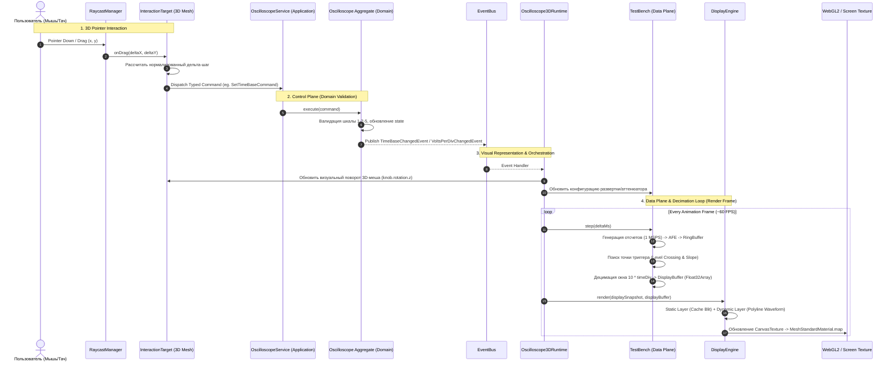

# Control-to-Display Architecture & Pipeline Flow

## 1. Overview & High-Level Philosophy

В соответствии с правилами `GEMINI.md` архитектура цифрового двойника строго разделяет:
- **Control Plane**: Обработка пользовательских действий, валидация команд, изменение состояния предметной области (Domain Model) и широковещание событий через `EventBus`.
- **Data Plane**: Непрерывный поток числовых отсчетов высокой частоты (1–5 MSPS), буферизация в `BoundedRingBuffer`, децимация и преобразование в `DisplayBuffer`.
- **Presentation Plane**: 3D-сцена Three.js, физическая анимация ручек/кнопок, внеэкранный рендеринг виртуального экрана (`DisplayEngine`) и передача в текстуру меша.

Настоящий документ описывает сквозной путь данных и управления: от перемещения курсора мыши над 3D-ручкой осциллографа до перерисовки формы волны на виртуальном экране.

---

## 2. Сквозная диаграмма последовательности (End-to-End Sequence Diagram)

---

## 3. Этапы сквозного тракта

### 3.1. Уровень 3D-взаимодействия (Pointer to Command)
1. **RaycastManager** проецирует нормализованные координаты экрана браузера `[-1, 1]` в мировые лучи Three.js.
2. При пересечении луча с интерактивным мешем ручки (например, `osc.knob.time`, `osc.knob.voltage`, `osc.knob.trigger_level`) активируется соответствующий `InteractionTarget`.
3. При зажатии и движении указателя мыши (`drag`) дельта вертикального смещения $\Delta y$ преобразуется в изменение дискретного шага шкалы.
4. **Инвариант**: 3D-меш ручки **не является источником истины** и не хранит текущее состояние осциллографа. Меш лишь формирует типизированную команду приложения:
   - `SetTimeBaseCommand { timeDiv: newTimeDiv }`
   - `SetChannelScaleCommand { channelId: 'ch1', voltsPerDiv: newVoltsDiv }`
   - `SetTriggerLevelCommand { level: newLevel }`

### 3.2. Уровень предметной области (Control Plane)
1. `OscilloscopeService` передает команду в агрегат осциллографа (`Oscilloscope`).
2. Агрегат проверяет допустимость значений по сетке 1-2-5 (например, $1\text{ мкс}, 2\text{ мкс}, 5\text{ мкс}, \dots, 1\text{ с}$ и $10\text{ мВ}, 20\text{ мВ}, 50\text{ мВ}, \dots, 10\text{ В}$).
3. При успешной валидации агрегат мутирует внутреннее состояние и генерирует доменные события:
   - `TimeBaseChangedEvent`
   - `VoltsPerDivChangedEvent`
   - `TriggerConfigChangedEvent`
4. События отправляются в асинхронную шину `EventBus`.

### 3.3. Реакция представления и 3D-манипуляторов
1. `Oscilloscope3DRuntime` подписан на события `EventBus`.
2. При получении события:
   - Вычисляется целевой угол поворота ручки:
     $$\theta = \text{index} \times \Delta\theta_{\text{step}}$$
   - Обновляется поворот меша (`knobMesh.rotation.z = angle`). Поворот меша является чистым отображением состояния домена (*Representation of Domain State*).
   - Обновляются параметры в блоке `TestBench` (или воркере сбора данных).

### 3.4. Тракт данных (Data Plane)
1. **Генератор сигнала** (`SignalGenerator`): синтезирует эталонный сигнал (по умолчанию $1\text{ кГц}$, $1.0\text{ В}$, $0\text{ В}$ offset, $1\text{ MSPS}$).
2. **Кольцевой буфер** (`BoundedRingBuffer`): предвыделенный массив `Float32Array` на 65 536 отсчетов. Запись ведется пакетами, без аллокаций.
3. **Виртуальный триггер**:
   - Производит поиск перехода через порог `triggerLevel` с заданным фронтом (`RISING` или `FALLING`).
   - Находит индекс $i_{\text{trig}}$, при котором $V[i_{\text{trig}}-1] < V_{\text{trig}} \le V[i_{\text{trig}}]$.
4. **Окно наблюдения и децимация**:
   - Длительность видимого окна на экране осциллографа строго равна:
     $$T_{\text{window}} = 10 \times \text{timeDiv}$$
   - Количество физических отсчетов в окне:
     $$N_{\text{window}} = T_{\text{window}} \times f_s$$
   - Дециматор формирует $M = 600$ точек для экранного буфера (`DisplayBuffer`), центрируя точку синхронизации $i_{\text{trig}}$ ровно по горизонтальному центру (деление 5.0).
   - Все операции выполняются в заранее выделенном массиве `Float32Array(600)` — **0 байт аллокаций в секунду**.

### 3.5. Отрисовка дисплея (Presentation Plane)
1. `DynamicDisplayLayer` получает `ch1DisplayBuffer` и текущие параметры шкалы.
2. Горизонтальное преобразование:
   - Равномерное распределение 600 точек по ширине сетки $W_{\text{grid}}$ от $x_{\text{left}}$ до $x_{\text{right}}$.
3. Вертикальное преобразование:
   $$\text{divOffset}_Y = \frac{V_{\text{sample}} - V_{\text{channelOffset}}}{\text{voltsDiv}}$$
   $$y_{\text{screen}} = y_{\text{center}} - \text{divOffset}_Y \cdot \left(\frac{H_{\text{grid}}}{8}\right)$$
4. Отрисовка происходит в закадровый канвас (`OffscreenCanvas`), который обновляет текстуру Three.js (`CanvasTexture`).
5. На каждом кадре Three.js рендерит меш 3D-экрана с наложенной текстурой с целевой частотой 60 FPS.

---

## 4. Метрологические инварианты тракта

| Регулятор | Что изменяет | Чего НЕ изменяет |
|---|---|---|
| **Volts/Div** | Вертикальный коэффициент отображения $\text{divOffset} = V / \text{voltsDiv}$ | Физическую амплитуду сигнала генератора и значения отсчетов в памяти |
| **Time/Div** | Длительность отображаемого временного окна $T_{\text{win}} = 10 \times \text{timeDiv}$ | Физическую частоту сигнала генератора и частоту дискретизации АЦП |
| **Trigger Level** | Точку фазового совмещения сигнала с центром экрана и положение маркера $\text{T}\blacktriangleright$ | Форму волны, частоту и амплитуду сигнала |

---

## 5. Защита от деградации производительности

1. **Zero Allocations**:
   Ни один объект (`new Float32Array`, `{ ... }`, массивы точек) не создается в цикле `step()` / `render()`. Все буферы предвыделены.
2. **Изоляция React**:
   Ни один sample из 1–5 MSPS потока не проходит через React State.
3. **Статическое кэширование**:
   Сетка делений, безель и рамки отрисовываются один раз в `_cachedCanvas` и блиттируются через $O(1)$ `drawImage`.
