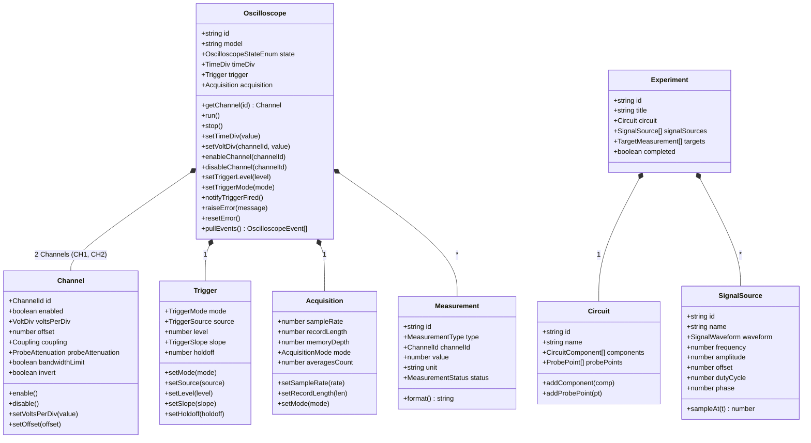

# Domain Model Architecture

## 1. Overview

Доменная модель цифрового двойника измерительного стенда с осциллографом спроектирована по принципам Domain-Driven Design (DDD) в строгой изоляции от пользовательского интерфейса (UI), React и Three.js. 

Домен оперирует исключительно чистыми сущностями, инвариантами физических величин, конечным автоматом состояний и типизированными командами/событиями.

---

## 2. Domain Entities Specification

### 2.1 Oscilloscope (Aggregate Root)
Координирует работу прибора как единого целого. Отвечает за:
- поддержание инвариантов (например, запрет отключения всех каналов одновременно);
- исполнение жизненного цикла через встроенный `OscilloscopeStateMachine`;
- накопление доменных событий (`pullEvents()`) для оповещения Control Plane.

### 2.2 Channel
Модель входного измерительного тракта (CH1, CH2):
- **Разрешенные масштабы (`VoltDiv`)**: стандартная сетка 1-2-5 от 1 мВ/дел до 10 В/дел (`1mV`, `2mV`, `5mV`, `10mV`, `20mV`, `50mV`, `100mV`, `200mV`, `500mV`, `1V`, `2V`, `5V`, `10V`);
- **Смещение (`offset`)**: инвариант — смещение не может превышать ±10 делений текущей шкалы `voltsPerDiv`;
- **Входная связь (`coupling`)**: `DC` (постоянный + переменный), `AC` (закрытый вход через разделительный конденсатор), `GND` (вход замкнут на землю);
- **Делитель щупа (`probeAttenuation`)**: `1X`, `10X`, `100X`;
- **Полоса пропускания (`bandwidthLimit`)**: аппаратно-программный фильтр 20 МГц.

### 2.3 Trigger
Подсистема синхронизации развертки:
- **Режимы (`mode`)**:
  - `AUTO` — генерация автотриггера по таймауту, если пороговое условие не наступило;
  - `NORMAL` — захват и отображение только при наступлении порогового события;
  - `SINGLE` — одиночный захват с автоматическим переходом в состояние `STOPPED` после заполнения буфера.
- **Источник (`source`)**: `CH1`, `CH2`, `EXT`;
- **Порог (`level`)**: пороговое напряжение в Вольтах;
- **Фронт (`slope`)**: `RISING` (нарастающий), `FALLING` (спадающий);
- **Holdoff (`holdoff`)**: время задержки повторного взвода триггера (сек).

### 2.4 Acquisition
Тракт оцифровки и буферизации:
- **Частота дискретизации (`sampleRate`)**: логическая частота от 100 SPS до 5 MSPS (5 000 000 выборок/сек);
- **Глубина памяти (`memoryDepth`)**: максимальный объем выборок для одного захвата (до 1 000 000 точек);
- **Длина записи (`recordLength`)**: активное число точек в кадре;
- **Режимы сбора (`mode`)**: `SAMPLE` (нормальный), `PEAK_DETECT` (детектирование пиков), `AVERAGE` (усреднение по 2..128 кадрам).

### 2.5 Measurement
Автоматические вычислители параметров сигналов:
- Типы: `Vpp`, `Vmax`, `Vmin`, `Vrms`, `Frequency`, `Period`, `DutyCycle`, `RiseTime`, `FallTime`;
- Статусы: `VALID`, `CLIPPED`, `NO_SIGNAL`, `COMPUTING`;
- Форматирование: вывод инженерных величин с приставками СИ (мВ, В, кГц, МГц, нс, мкс, мс, с, %).

### 2.6 SignalSource
Виртуальный лабораторный функциональный генератор:
- Формы сигналов: `SINE`, `SQUARE`, `TRIANGLE`, `SAWTOOTH`, `NOISE`, `PWM`;
- Параметры: частота (Гц), размах амплитуды (В), смещение (В), скважность (%), фаза (градусы);
- Метод `sampleAt(t: number)`: аналитическое мгновенное значение напряжения в момент времени $t$.

### 2.7 Circuit
Схемотехническая модель исследуемой лабораторной цепи:
- Список компонентов: резисторы, конденсаторы, катушки индуктивности, источники напряжения;
- Узлы схемы (Nodes);
- Контрольные точки подключения виртуальных щупов (`probePoints`).

### 2.8 Experiment
Контекст лабораторной работы студента:
- Привязка к целевой схеме `Circuit`;
- Набор активных генераторов `SignalSource`;
- Список контрольных критериев измерений (`targets`);
- Состояние выполнения (`completed`).

---

## 3. Invariant & Isolation Guarantees

1. **Zero External UI Dependencies**: файлы пакета `src/domain/` не содержат импортов из `react`, `three`, DOM-типов (`window`, `document`, `HTMLElement`).
2. **Deterministic Execution**: все вычисления и переходы состояний детерминированы и покрыты unit-тестами.
3. **No Circular Dependencies**: граф связей внутри `src/domain/` является направленным ациклическим графом (DAG), что верифицируется утилитой `scripts/check-boundaries.mjs`.
