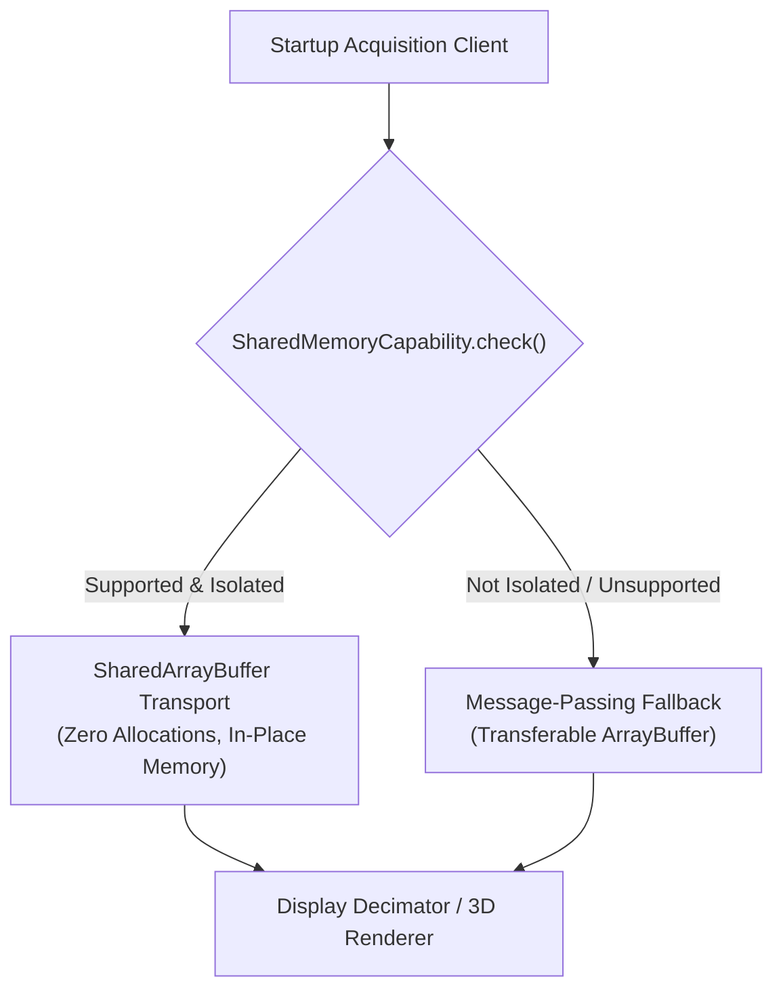

# SharedArrayBuffer Data Plane Architecture

## 1. Overview & Architectural Motivation

В соответствии с правилами `GEMINI.md` (Раздел 1, 2, 11) цифровая модель цифрового осциллографа строго разделяет:
- **Control Plane**: редкие команды управления (`INIT`, `START`, `STOP`, `CONFIGURE`, `RESET`), изменение параметров шкал, связь с UI. Этот уровень всегда использует стандартный асинхронный обмен сообщениями `postMessage`.
- **Data Plane**: непрерывный высокочастотный поток числовых отсчетов (1–5 MSPS).

### 1.1. Проблема наивного Message-Passing (Wave 8 Baseline)
В архитектуре с передачей отсчетов через `Transferable ArrayBuffer`:
1. Воркер на каждом такте (50–60 Гц) выделяет новые массивы `Float32Array` под CH1 и CH2;
2. При частоте 1–5 MSPS и пакетах по 20 000 – 100 000 отсчетов темп аллокаций в памяти составляет от **16 МБ/с до 40 МБ/с**;
3. Постоянная генерация и сброс массивов вызывает циклы сборщика мусора (Garbage Collector pauses), приводя к микрофризам анимации;
4. Передача владения буфером лишает воркер возможности повторного использования памяти без создания новых объектов.

### 1.2. Решение: Селективный SharedArrayBuffer
`SharedArrayBuffer` используется **исключительно** для циклического буфера потоковых данных высокой частоты между Acquisition Worker и потребителями (Main Thread / DSP Worker).

Преимущества:
- **Zero Allocations**: 0 байт аллокаций в секунду в рабочем цикле;
- **Sub-Microsecond Latency**: прямой доступ к общей памяти в одном адресном пространстве процесса;
- **Кэш-локальность**: фиксированный буфер размером 512 КБ полностью помещается в L2/L3 кэш процессора;
- **Строгая изоляция Control Plane**: команды управления не используют SAB.

---

## 2. Бинарный макет памяти (Memory Layout)

Буфер памяти выровнен по границе 128 байт. Структура `SharedArrayBuffer` (524 416 байт для емкости 65 536 отсчетов на 2 канала):

```text
SharedArrayBuffer
┌──────────────────────────────────────────────────────────────────┐
│ HEADER & CONTROL BLOCK (128 байт = 32 слова Int32)               │
├──────┬──────────────────────┬────────────────────────────────────┤
│ Word │ Идентификатор        │ Назначение                         │
├──────┼──────────────────────┼────────────────────────────────────┤
│ [0]  │ IDX_MAGIC            │ Сигнатура 0x53414231 ("SAB1")      │
│ [1]  │ IDX_VERSION          │ Версия макета (1)                  │
│ [2]  │ IDX_CAPACITY         │ Емкость канала (степень двойки)    │
│ [3]  │ IDX_SAMPLE_RATE      │ Частота дискретизации (1 000 000)  │
│ [4]  │ IDX_WRITE_INDEX      │ Монотонный указатель записи (Int32)│
│ [5]  │ IDX_READ_INDEX       │ Монотонный указатель чтения (Int32)│
│ [6]  │ IDX_SEQUENCE         │ Счетчик зафиксированных пакетов    │
│ [7]  │ IDX_STATE            │ 0=IDLE, 1=RUNNING, 2=STOPPED, 3=ERR│
│ [8]  │ IDX_OVERFLOW_COUNT   │ Счетчик перезаписанных отсчетов    │
│ [9]  │ IDX_UNDERRUN_COUNT   │ Счетчик попыток чтения из пустого  │
│ [10] │ IDX_FLAGS            │ Битовая маска: клиппинг CH1/CH2    │
│ [11] │ IDX_PRODUCED_TS_LOW  │ Метка времени (младшие 32 бита)    │
│ [12] │ IDX_PRODUCED_TS_HIGH │ Метка времени (старшие 32 бита)    │
│ [13] │ IDX_BATCH_INDEX      │ Индекс последнего пакета           │
│[14..]│ RESERVED / PADDING   │ Выравнивание до 128 байт           │
├──────┴──────────────────────┴────────────────────────────────────┤
│ CH1 SAMPLE DATA (capacity * 4 байта = 262 144 байт)              │
│ Float32Array[0 .. capacity - 1]                                  │
├──────────────────────────────────────────────────────────────────┤
│ CH2 SAMPLE DATA (capacity * 4 байта = 262 144 байт)              │
│ Float32Array[0 .. capacity - 1]                                  │
└──────────────────────────────────────────────────────────────────┘
```

---

## 3. Семантика синхронизации Atomics (SPSC Lock-Free)

В архитектуре применяется бесконфликтная модель **Single Producer Single Consumer (SPSC)**:

### 3.1. Сторона писателя (Acquisition Worker) — Store-Release
1. Записывает отсчеты каналов CH1 и CH2 в предвыделенные слоты памяти по безветвевой маске `(writeIndex + i) & (capacity - 1)`;
2. Записывает флаги переполнения и клиппинга;
3. Выполняет `Atomics.add(ctrl, IDX_SEQUENCE, 1)` для фиксации факта обновления кадра;
4. Публикует новый указатель записи: `Atomics.store(ctrl, IDX_WRITE_INDEX, newWriteIndex)`.

### 3.2. Сторона читателя (Main Thread / DSP) — Load-Acquire
1. Загружает указатель записи: `writeIndex = Atomics.load(ctrl, IDX_WRITE_INDEX)`;
2. Загружает указатель чтения: `readIndex = Atomics.load(ctrl, IDX_READ_INDEX)`;
3. Рассчитывает доступное число отсчетов: `available = (writeIndex - readIndex) >>> 0`;
4. Считывает данные из `Float32Array` в целевой экранный буфер децимации;
5. Фиксирует новый указатель чтения: `Atomics.store(ctrl, IDX_READ_INDEX, newReadIndex)`.

> [!CAUTION]
> **Запрет `Atomics.wait()` на основном потоке браузера**:
> В соответствии со спецификацией ECMAScript и правилами безопасности браузеров вызов `Atomics.wait()` в Main Thread запрещен и приводит к исключению `TypeError: Atomics.wait cannot be called in this context`.
> Читатель в основном потоке использует исключительно неблокирующий `Atomics.load()`. Ожидание и блокировка через `Atomics.wait()` допускаются только в фоновых DSP-воркерах.

---

## 4. Детектор возможностей и прозрачный Fallback



### 4.1. Детектор `SharedMemoryCapability`
Проверяет:
1. `typeof SharedArrayBuffer !== 'undefined'`;
2. `typeof Atomics !== 'undefined'`;
3. `crossOriginIsolated === true` в контексте браузера;
4. Безопасную пробную аллокацию 16-байтного тестового буфера.

### 4.2. Fallback на `MessagePassingTransport`
Если заголовки COOP/COEP отсутствуют (например, при встраивании в сторонний iframe или на простых статических хостингах без возможности настройки HTTP-заголовков), приложение **не падает с ошибкой**, а автоматически и прозрачно переключается на проверенный буферизованный транспорт `MessagePassingTransport` на базе `Transferable ArrayBuffer`.

---

## 5. Требования к Cross-Origin Isolation

Для активации `SharedArrayBuffer` веб-сервер обязан отдавать следующие HTTP-заголовки:

```http
Cross-Origin-Opener-Policy: same-origin
Cross-Origin-Embedder-Policy: require-corp
```

### 5.1. Конфигурация для Vite (`vite.config.ts`)
```ts
import { defineConfig } from 'vite';

export default defineConfig({
  server: {
    headers: {
      'Cross-Origin-Opener-Policy': 'same-origin',
      'Cross-Origin-Embedder-Policy': 'require-corp',
    },
  },
  preview: {
    headers: {
      'Cross-Origin-Opener-Policy': 'same-origin',
      'Cross-Origin-Embedder-Policy': 'require-corp',
    },
  },
});
```

### 5.2. Конфигурация для Nginx
```nginx
add_header Cross-Origin-Opener-Policy "same-origin" always;
add_header Cross-Origin-Embedder-Policy "require-corp" always;
```

### 5.3. Конфигурация для Caddy
```caddy
header {
    Cross-Origin-Opener-Policy "same-origin"
    Cross-Origin-Embedder-Policy "require-corp"
}
```
