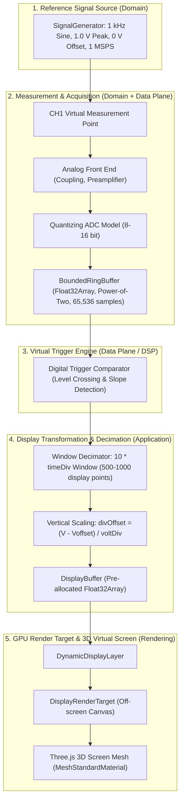

# Test Bench: End-to-End Verification Pipeline

## 1. Overview & Objectives

Для обеспечения инженерной строгости и воспроизводимости цифрового двойника лабораторного осциллографа (`GEMINI.md`) создан сквозной **Test Bench** (`src/application/testbench/TestBench.ts`).

Test Bench решает ключевую задачу: объединяет все независимые модули системы в единый детерминированный измерительный контур без использования демо-заглушек:

---

## 2. Физические параметры эталонного сигнала

В соответствии с методикой аттестации измерительного прибора используется эталонный синусоидальный сигнал:
- **Форма волны**: `SINE`
- **Частота**: $f = 1000\text{ Гц}$ (период $T_0 = 1.0\text{ мс}$)
- **Пиковая амплитуда**: $A = 1.0\text{ В}$ ($V_{pp} = 2.0\text{ В}$)
- **Постоянное смещение**: $V_{\text{offset}} = 0.0\text{ В}$
- **Начальная фаза**: $\phi = 0^\circ$
- **Частота дискретизации**: $f_s = 1\,000\,000\text{ отсчетов/с}$ ($1\text{ MSPS}$, шаг $\Delta t = 1.0\ \mu\text{с}$)

Количество отсчетов на один период сигнала:
$$N_{\text{period}} = \frac{f_s}{f} = \frac{1\,000\,000}{1\,000} = 1000\text{ отсчетов}$$

---

## 3. Архитектурное разделение: физический сигнал vs. отображение

Критическое требование проекта — строгое соблюдение инвариантов метрологии:

### 3.1. Регулятор `Volts/Div`
- **НЕ изменяет** физический сигнал генератора или оцифрованные отсчеты в буфере. Амплитуда сигнала в памяти всегда равна $1.0\text{ В}$.
- **Изменяет исключительно** вертикальное преобразование координат на экране:
  $$\text{divOffset}_Y = \frac{V_{\text{sample}} - V_{\text{channelOffset}}}{\text{voltsDiv}}$$
  $$y_{\text{screen}} = y_{\text{center}} - \text{divOffset}_Y \cdot \left(\frac{H_{\text{grid}}}{8}\right)$$
- При $V_{\text{peak}} = 1.0\text{ В}$:
  - При $1.0\text{ В/дел}$: отклонение составляет ровно $+1.0\text{ деление}$;
  - При $0.5\text{ В/дел}$: отклонение составляет $+2.0\text{ деления}$ ($2\times$ крупнее на экране);
  - При $2.0\text{ В/дел}$: отклонение составляет $+0.5\text{ деления}$ ($0.5\times$ меньше на экране).

### 3.2. Регулятор `Time/Div`
- **НЕ изменяет** физическую частоту сигнала ($f \equiv 1000\text{ Гц}$).
- **Изменяет исключительно** длительность наблюдаемого временного окна:
  $$T_{\text{window}} = 10 \times \text{timeDiv}$$
  $$N_{\text{window}} = T_{\text{window}} \times f_s$$
- Для сигнала $1\text{ кГц}$:
  - При $1.0\text{ мс/дел}$ ($T_{\text{win}} = 10\text{ мс}$): на экране наблюдается ровно 10 периодов;
  - При $0.5\text{ мс/дел}$ ($T_{\text{win}} = 5\text{ мс}$): на экране наблюдается ровно 5 периодов;
  - При $0.2\text{ мс/дел}$ ($T_{\text{win}} = 2\text{ мс}$): на экране наблюдается ровно 2 периода;
  - При $5.0\text{ мс/дел}$ ($T_{\text{win}} = 50\text{ мс}$): на экране наблюдается 50 периодов.

### 3.3. Регулятор `Trigger Level`
- Находит точку перехода через порог:
  - Нарастающий фронт (`RISING`): $V[k-1] < V_{\text{trig}} \le V[k]$;
  - Спадающий фронт (`FALLING`): $V[k-1] > V_{\text{trig}} \ge V[k]$.
- Выравнивает найденную точку по горизонтальной метке синхронизации (центр экрана, деление 5.0).
- При выходе порога за пределы размаха сигнала ($V_{\text{trig}} > 1.0\text{ В}$):
  - Режим `AUTO`: свободный бег развертки (free-run) по последним отсчетам;
  - Режим `NORMAL`: остановка обновления кадра (ожидание события синхронизации).

---

## 4. Диагностическая телеметрия (`TestBenchTelemetry`)

В Test Bench встроен интерфейс интроспекции параметров:

| Поле | Тип | Единицы | Описание |
|---|---|---|---|
| `frequency` | `number` | Гц | Физическая частота генератора (1000) |
| `amplitude` | `number` | В | Пиковая амплитуда генератора (1.0) |
| `sampleRate` | `number` | отсч/с | Частота оцифровки АЦП (1 000 000) |
| `timeDiv` | `number` | с/дел | Текущая горизонтальная цена деления |
| `voltsDiv` | `number` | В/дел | Текущая вертикальная цена деления CH1 |
| `triggerLevel` | `number` | В | Установленный уровень порога синхронизации |
| `visibleTimeWindow` | `number` | с | Длительность развертки ($10 \times \text{timeDiv}$) |
| `displayBufferSize` | `number` | точек | Число выводимых точек децимации (600) |
| `triggerPosition` | `number` | дел | Позиция метки триггера (5.0 = центр) |
| `triggered` | `boolean` | — | Флаг захвата синхронизации компаратором |
| `totalAcquiredSamples` | `number` | отсч | Общее число оцифрованных отсчетов |

Телеметрия выводится в оверлей HUD браузера в реальном времени с периодом 250 мс.

---

## 5. Автоматизированные тесты сквозного тракта (`tests/application/test-bench.test.ts`)

Набор из 7 автоматизированных тестов валидирует:
1. Инициализацию генератора и непрерывное наполнение кольцевого буфера.
2. Фиксацию триггера на нарастающем фронте при пороге 0.0 В.
3. Независимость физического сигнала от регулятора Volts/Div (масштабирование только экранного преобразования).
4. Независимость физической частоты от регулятора Time/Div (изменение только числа периодов в окне).
5. Фазовое выравнивание формы волны по уровню порога триггера.
6. Сквозную реакцию на поворот 3D-ручки Time/Div: `drag -> command -> domain -> 3D mesh rotation -> display update`.
7. Сквозную реакцию на поворот 3D-ручки Volt/Div.
